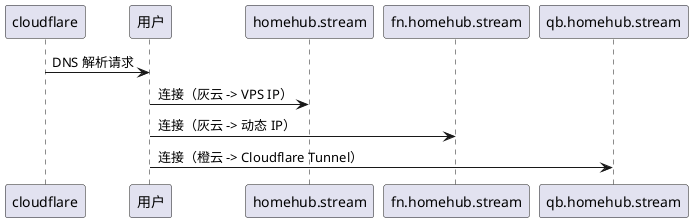

---

title: 使用 Cloudflare Tunnel + Nginx 实现多子域混合访问架构
date: 2025-07-05 22:18:07
tags:
  - Cloudflare
  - Tunnel
  - Nginx
  - HomeLab
  - 反向代理
  - 自建服务
categories:
  - 网络架构
description: "基于 Cloudflare Tunnel 与本地 Nginx 构建一套安全、灵活、高性能的家庭服务器多子域访问方案，兼顾隐私与速度，适合新手部署。"
toc: true
comments: true

---

> 🚀 一套基于“动态公网 IP + Tunnel + Nginx”的多子域访问方案，适用于自建 NAS、面板、媒体中心等家庭服务场景，性能与隐私兼顾，适合新手实战部署。

---

## 一、背景故事：家宽环境下的访问烦恼

如果你是 HomeLab 爱好者，肯定绕不过这样一个需求：

> “我有好多本地服务，分别监听在 `qb:8085`, `tr:9091`, `chat:3009`, `panel:17859`, `fn:12680` 等端口，如何让它们被公网访问？还要安全、高效、有点逼格。”

理想状态下我们想实现：

* 主域名 `homehub.stream` 与 `www.homehub.stream` 指向远程 VPS；
* 子域如 `fn`（飞牛OS）、`v`（Jellyfin 媒体中心）、`m`（Navidrome 音乐服务器）保持高速访问，直连本地；
* 其他如 `qb`（qBittorrent 下载器）、`tr`（Transmission 下载器）、`chat`（VoiceChat UI）、`ql`（青龙面板）通过 Cloudflare Tunnel 安全代理；
* 配置清晰、易于维护，支持 Nginx 优化与 Cloudflare 特性结合。

---

## 二、技术原理：动态公网 + DNS + Tunnel + Nginx = 混合访问

### 1. Cloudflare Tunnel 究竟解决了什么？

Cloudflare Tunnel（前身 Argo Tunnel）核心能力是：**不暴露端口、不依赖公网 IP 即可让 Cloudflare 边缘访问你的内网服务**。

关键特性如下：

* 🛰️ **内网发起连接**，打通隧道；
* 📶 **TLS 加密**，即使是 HTTP 服务也可安全暴露；
* 🎯 **精细控制入口规则**，不同子域映射不同服务；
* 🛡️ **绕过运营商封锁**，如封禁 80/443 端口或禁止端口转发的 ISP。

> ✅ 若你处于 CGNAT 下，无公网 IP，这种方案是刚需；但若需“灰云直连”，仍然要求设备具备公网 IP（可动态）。

### 2. DNS 配置逻辑



🌫️ 灰云的本质是“只做 DNS 解析”，Cloudflare 不参与转发，客户端直连你的服务器 IP。

☁️ 橙云本质是“Cloudflare 中转 + WAF + 缓存 + Zero Trust 接入 + 隧道支持”，属于完整代理方案。

### 3. Nginx 为什么监听 8443？

这是一个兼顾安全与兼容的最佳实践：

* 避免系统服务（80/443）端口冲突（最重要的是 运营商封锁，用不了啊）；
* 提供独立入口，用于 cloudflared 或灰云子域统一反代；
* 配置灵活，易于集中管理。

此外，监听 HTTPS（ssl http2）可显著提升性能与兼容性，对如 Jellyfin、Navidrome 等媒体服务尤为重要。


---

## 三、完整部署流程

### 第一步：Cloudflare DNS 配置

| 子域名                                          | 类型  | 目标                      | 云状态 |
| ----------------------------------------------- | ----- | ------------------------- | ------ |
| homehub.stream                                  | A     | VPS 公网 IP（略去）       | 灰云   |
| [www.homehub.stream](http://www.homehub.stream) | A     | VPS 公网 IP（略去）       | 灰云   |
| fn.homehub.stream                               | A     | 家宽公网 IP（动态）       | 灰云   |
| v.homehub.stream                                | A     | 家宽公网 IP（动态）       | 灰云   |
| m.homehub.stream                                | A     | 家宽公网 IP（动态）       | 灰云   |
| \*.homehub.stream                               | CNAME | `<UUID>.cfargotunnel.com` | 橙云   |

### 第二步：cloudflared 配置说明

路径：`/root/.cloudflared/config.yml`

```yaml
tunnel: HomeTunnels
token: eyJhIjoi...（隐藏）
protocol: http2
originRequest:
  noTLSVerify: true
  originServerName: homehub.stream

ingress:
  - hostname: panel.homehub.stream
    service: http://localhost:17859
  - hostname: ql.homehub.stream
    service: http://localhost:9091
  - hostname: qb.homehub.stream
    service: http://localhost:8085
  - hostname: tr.homehub.stream
    service: http://localhost:9091
  - hostname: chat.homehub.stream
    service: http://localhost:3009
  - hostname: fn.homehub.stream
    service: https://localhost:8443
  - hostname: v.homehub.stream
    service: https://localhost:8443
  - hostname: m.homehub.stream
    service: https://localhost:8443
  - service: http_status:404
```


### 第三步：启动 cloudflared（无需自定义 systemd）

推荐直接使用 Cloudflare 官方推荐命令启动（无需手写服务文件）：

```bash
cloudflared tunnel run --config /root/.cloudflared/config.yml HomeTunnels
```

> ✅ 如果你需要开机启动，可以使用 `cloudflared service install` 进行自动配置。

---

## 四、Nginx 多子域配置

以 fn.homehub.stream 为例：

```nginx
server {
  listen 8443 ssl http2;
  server_name fn.homehub.stream;

  ssl_certificate /etc/ssl/fullchain.pem;
  ssl_certificate_key /etc/ssl/privkey.pem;

  location / {
    proxy_pass http://127.0.0.1:12680;
    include proxy_params;
  }
}
```

---

## 五、流程图解：请求如何流动？

```plantuml
@startuml
actor User
participant "Cloudflare Edge" as Edge
participant "cloudflared (本地隧道客户端)" as Tunnel
participant "Nginx@8443" as Nginx
participant "服务后端 (如 Jellyfin)" as App

User -> Edge : 请求 v.homehub.stream
Edge -> Tunnel : 转发到 https://localhost:8443
Tunnel -> Nginx : 本地 8443 接收
Nginx -> App : 反代到 http://127.0.0.1:端口
App --> Nginx --> Tunnel --> Edge --> User : 响应返回
@enduml
```

---

## 六、服务状态展示（来自 1Panel）

| 子域名            | 类型     | 协议  | 状态   | 证书到期   |
| ----------------- | -------- | ----- | ------ | ---------- |
| fn.homehub.stream | 反向代理 | HTTPS | 已启动 | 2025-10-02 |
| v.homehub.stream  | 反向代理 | HTTPS | 已启动 | 2025-10-02 |
| m.homehub.stream  | 反向代理 | HTTPS | 已启动 | 2025-10-02 |

---

## 七、快速测试脚本

```bash
domains=(homehub www fn v m panel ql qb tr chat unknown)
for d in "${domains[@]}"; do
  echo -n "$d: "
  curl -Ik https://$d.homehub.stream || echo "❌ unreachable"
done
```

---

## 八、附加建议

* 🔐 **Cloudflare Access**：为敏感服务如 ql/chat 增加身份验证；
* 📈 **日志分析建议**：Nginx + Cloudflare Dashboard 双管齐下；
* 🌍 **DDNS 自动更新脚本**：每次拨号变 IP 自动刷新灰云记录；
* 🧩 **组合方案拓展**：加入 frp、tailscale 可进一步优化链路弹性。

---

## 九、总结

| 特性     | 效果                           |
| -------- | ------------------------------ |
| ✅ 灵活性 | 子域按需配置，本地/VPS 可控    |
| 🔐 安全性 | 灰云直连 + 橙云 Tunnel 隐匿    |
| ⚡ 性能   | 高频服务本地直达，低频走隧道   |
| 🤹‍♂️ 易维护 | 配置集中，统一 reload 自动生效 |

---

📌 **最后提醒**：

> 本方案支持“动态拨号获取公网 IP”，不适用于纯 CGNAT 封闭内网场景。若你的 ISP 不分配公网 IP，请考虑完全基于 Cloudflare Tunnel 或使用 Tailscale + Nginx 构建 Overlay 访问体系。
